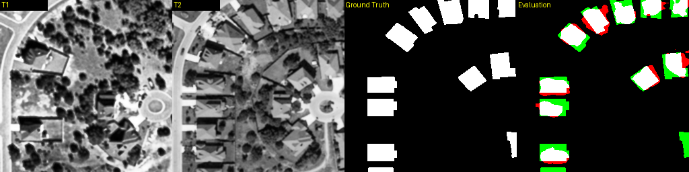
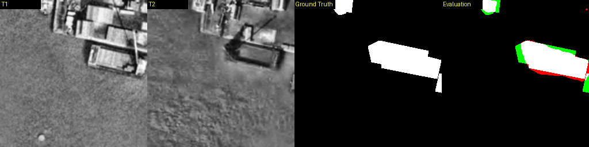
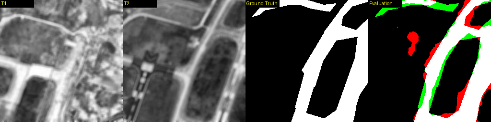
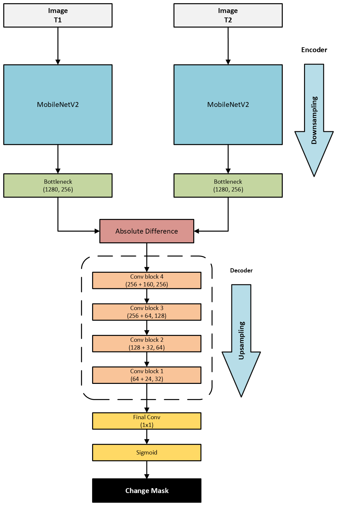

# System for change detection from satellite data using artificial intelligence






- Precision: 0.9428
- Recall: 0.8794
- F1-Score: 0.9100
- IoU: 0.7383
- Pixel Accuracy: 0.9638
- Size: 10.63MB

## Model architecture



## Requirements

### Python 3.13.2 
[link](https://www.python.org/downloads/release/python-3132/)
### Virtual enviroment
create
```bash  
python -m venv venv
``` 
activate
```bash  
.\venv\Scripts\activate
```
### PyTorch CUDA
```bash
pip3 install torch torchvision torchaudio --index-url https://download.pytorch.org/whl/cu126 
```
### Other libraries
```bash
pip install -r requirements.txt
```
### Run
```bash
python train.py
```
### Evaluate
```bash
python eval.py
```
## Dataset

```bash
 dataset/
 |-- train/
 |   |-- t1/
 |   |-- t2/
 |   |-- mask/
 |
 |-- val/
 |   |-- t1/
 |   |-- t2/
 |   |-- mask/
 |
 |-- test/
 |   |-- t1/
 |   |-- t2/
 |   |-- mask/
 ```
